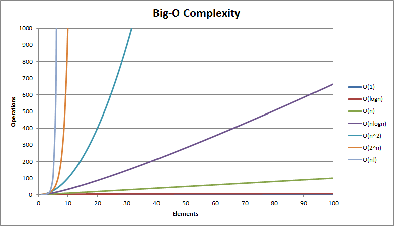

# Big-Oh exercises

Data Structures & Algorithms, per: https://courses.thinkful.com/dsa-v1/checkpoint/3#assignment

Big-O Cheet Sheet: https://tf-assets-prod.s3.amazonaws.com/tf-curric/data-science/Thinksheet-BigO.pdf

To run any of these scripts, in terminal command line enter: `node script-name.js`

 

## Computational Complexity script examples

Aside: [Big-O Classifications chart](https://github.com/mariusbanea/web-developers-toolkit/blob/master/algorithms/big-o-notation/big-o-notation-table-for-interviews.pdf)

Chart: the different runtime complexities with relation to their input sizes...

Table: the number of operations required by different time complexities with inputs of size 10, 100, and 1000...
| Big-O Notation | n = 10 | n = 100 | n = 1000 |
| -------------- | ------ | ------- | -------- |
|O(1)            | 1      |	1	    | 1        |
|O(log n)        | 3	  | 6	    | 9        |
|O(n)	         | 10	  | 100     | 1000     |
|O(n^2)	         | 100	  | 10000	| 1000000  |
|O(2^n)	         | 1024	  | 2^100	| 2^1000   |

 

**O(1)** **`constant-time.js`** 
Constant time complexity is the "holy grail". No matter the size of your input, the algorithm will take the same amount of time to complete.

**O(log n)** **`logarithmic-time.js`** 
Time increases with size of data, but not proportionately so (like linear time). Every time you double `n`, the runtime only increases one step. Conversely, it is also characteristic of logarithmic algorithms that they cut the problem size in half each round through. Same same but different, [CS50 Phone Book demo](https://www.youtube.com/watch?v=DSffdCT5Cx4) 

**O(n)** **`linear-time-sum.js`** / **`linear-time-find.js`**
Algorithms with linear time complexity have running times that are directly proportional to the size (n) of the input. 

**O(n^k)** **`polynomial-time.js`**
An algorithm with polynomial time complexity has a running time that would be some input size `n` raised to some constant power `k`. The easiest way to understand polynomial time complexity is with nested loops.

**O(2^n)** **`exponential-time.js`**
No clue what the purpose of the function is for, even after it's explained to me. haha.